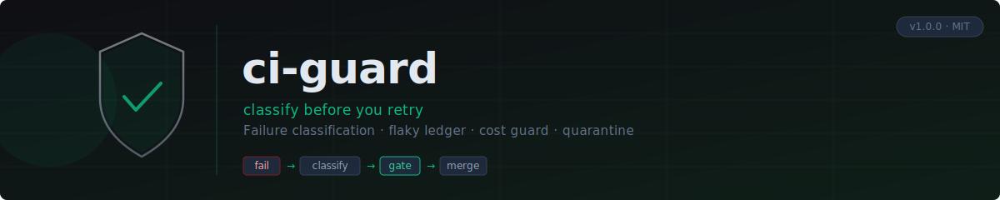

<p align="center">
  
</p>

<p align="center">
  <strong>Stop burning CI minutes on blind retries. Classify every failure before touching rerun.</strong>
</p>

<p align="center">
  <a href="https://github.com/Viniciuscarvalho/ci-guard/actions/workflows/ci.yml">
    
  </a>
  <a href="https://github.com/Viniciuscarvalho/ci-guard/releases">
    
  </a>
  <a href="https://github.com/Viniciuscarvalho/ci-guard/blob/main/LICENSE">
    
  </a>
  <a href="https://github.com/Viniciuscarvalho/ci-guard">
    
  </a>
  <a href="https://github.com/Viniciuscarvalho/ci-guard">
    
  </a>
  <a href="https://github.com/Viniciuscarvalho/ci-guard">
    
  </a>
  <a href="https://github.com/sponsors/Viniciuscarvalho">
    
  </a>
  <a href="https://skills.sh/openai/codex/ci-guard">
    
  </a>
</p>

<p align="center">
  <code>failure classification</code> · <code>flaky ledger</code> · <code>cost guard</code> · <code>verify greens</code> · <code>quarantine</code> · <code>GitHub Actions</code>
</p>

---

Protects your CI from two failure modes that silently drain money and hide bugs:

1. **Blind retries** — a check fails, someone hits "rerun failed jobs", it passes, the PR merges. The flaky test never gets fixed and burns minutes on every future PR.
2. **Trusting a single green** — a known-flaky test passes once after several failures. The PR merges. Production breaks.

ci-guard makes your coding agent refuse to retry until a failure is _classified_, and refuse to trust a green on a known-flaky test until it is _verified_.

---

> **Compatibility** — ci-guard's Python scripts call no LLM and require no API key.
> Your coding agent reads `SKILL.md` and drives the scripts via your shell. It works
> with Claude Code, OpenAI Codex, opencode, skills.sh runtimes, and any agent that
> can paste `SKILL.md` into its context (Gemini CLI, Cursor, Copilot, etc.).
>
> → See [`docs/agents.md`](docs/agents.md) for the full agent matrix and install paths.

## Quick start

**Step 1 — register the skill (once per machine)**

Pick the path for your agent:

```bash
# Claude Code
ln -s /path/to/ci-guard ~/.claude/skills/ci-guard

# Codex
ln -s /path/to/ci-guard ~/.codex/skills/ci-guard

# opencode
ln -s /path/to/ci-guard ~/.opencode/skills/ci-guard

# Any skills.sh-compatible runtime (auto-detects the right path)
npx skills add https://github.com/Viniciuscarvalho/ci-guard --skill ci-guard

# Gemini CLI / Cursor / other — no native skill path; paste SKILL.md content
# into your agent context file (GEMINI.md, .cursorrules, etc.) instead.
```

**Step 2 — bootstrap a repo (once per project, from repo root)**

```bash
python3 /path/to/ci-guard/scripts/bootstrap.py
git add .ci-guard .gitignore && git commit -m "ci: bootstrap ci-guard"
```

```bash
# Snapshot a failing PR
python3 .ci-guard/scripts/ci_watch.py --pr auto --once

# Budget-safe retry (refuses on branch_failure or exhausted budget)
python3 .ci-guard/scripts/ci_watch.py --pr auto --retry-failed-now

# Verify a flaky green before merging
python3 .ci-guard/scripts/ci_watch.py --pr auto --verify-flaky-green
```

---

## How it works

Every retry decision goes through a strict gate sequence:

```
Failure detected
      │
      ▼
Gate 1 — Snapshot      classify all failing checks
      │
      ▼
Gate 2 — Classify      branch_failure? → never retry, patch code
                        infra_flake?    → retry once if budget allows
                        test_flake?     → retry once + verify the green
                        dependency?     → retry once; second time = branch_failure
                        unknown?        → read logs manually, never auto-retry
      │
      ▼
Gate 3 — Cost guard    retries_per_job / retries_per_pr / minutes_per_pr
                        budget exceeded? → stop, surface to user
      │
      ▼
Gate 4 — Verify green  test_flake turned green? → require one verification rerun
                        two consecutive greens on same SHA → trust it
      │
      ▼
Gate 5 — Quarantine    failure_count_30d ≥ 3 AND flake_rate ≥ 5%?
                        → recommend quarantine (human decides)
      │
      ▼
Gate 6 — Loop           --watch streams JSONL until terminal state
                        pr_merged / pr_closed → exit 0
                        needs_help            → exit 2 (intervene)
                        budget_exhausted      → exit 3 (investigate)
```

### Failure classifications

| Class                | What it means                                                        | Action                                             |
| -------------------- | -------------------------------------------------------------------- | -------------------------------------------------- |
| `branch_failure`     | Compile error, type error, lint fail, test in a file this PR touched | **Never retry.** Fix the code.                     |
| `infra_flake`        | Runner shutdown, DNS timeout, registry 502, disk pressure            | Retry once within budget.                          |
| `test_flake`         | Test appears in the flaky ledger, or log shows race/timeout language | Retry once + verify the resulting green.           |
| `dependency_failure` | npm/pip/cargo registry 5xx, lockfile drift                           | Retry once. Recurs on same SHA → `branch_failure`. |
| `unknown`            | Heuristics couldn't classify                                         | Read the log manually. Never default to retry.     |

### Retry budgets (default, configurable)

| Budget            | Default | Meaning                                  |
| ----------------- | ------- | ---------------------------------------- |
| `retries_per_job` | 2       | Max reruns of one job per PR             |
| `retries_per_pr`  | 5       | Max reruns across all jobs per PR        |
| `minutes_per_pr`  | 90      | Cumulative CI minutes consumed by reruns |

Exceeding any budget stops all retries and surfaces the situation. There are no warnings or grace periods — friction is the point.

### Flaky ledger

`.ci-guard/flaky-ledger.json` is committed to the repo. It records every test failure and pass event with a rolling 30-day window. Each entry tracks:

- `failure_count_30d` / `pass_count_30d` — rolling counts
- `flake_rate` — `failures / (failures + passes)` over 30 days
- `status` — `watched`, `quarantined`, or `fixed`
- `events` — append-only log (source of truth for all derived fields)

A test crosses the quarantine threshold at `failure_count_30d ≥ 3` AND `flake_rate ≥ 5%`. ci-guard recommends quarantine; a human confirms it.

### Using ci-guard as an engine

`--watch` emits JSONL until a `terminal` value is set. Each snapshot's `actions` list tells the caller what to do next; ci-guard never executes mutations.

```python
#!/usr/bin/env python3
"""Minimal wrapper: consume ci-guard --watch JSONL and execute actions."""
import json, subprocess, sys

pr = sys.argv[1] if len(sys.argv) > 1 else "auto"
proc = subprocess.Popen(
    ["python3", ".ci-guard/scripts/ci_watch.py", "--pr", pr, "--watch"],
    stdout=subprocess.PIPE, text=True,
)
for line in proc.stdout:
    snap = json.loads(line)
    for action in snap.get("actions", []):
        a = action["action"]
        if a == "retry_failed_now":
            subprocess.run(["python3", ".ci-guard/scripts/ci_watch.py",
                            "--pr", pr, "--retry-failed-now"])
        elif a == "verify_flaky_green":
            subprocess.run(["python3", ".ci-guard/scripts/ci_watch.py",
                            "--pr", pr, "--verify-flaky-green"])
        elif a == "stop":
            print(f"ci-guard: terminal={snap['terminal']}", flush=True)
            proc.terminate()
            sys.exit(0 if snap["terminal"] in {"pr_merged", "pr_closed"} else 1)
```

The complete JSON contract — every snapshot field, action shape, terminal value, and exit code — is in `references/wrapper-contract.md`.

---

## Project structure

```
ci-guard/
├── SKILL.md                          # Playbook any agent reads at runtime
├── scripts/
│   ├── ci_watch.py                   # Snapshot CI state, classify, gate retries
│   ├── classify_failure.py           # Heuristic log analysis
│   ├── flaky_ledger.py               # Persistent flaky-test ledger CLI + Python API
│   └── config.py                     # Shared paths, budget defaults, config loader
├── references/
│   ├── heuristics.md                 # Failure classification decision tree
│   ├── cost-controls.md              # Retry budgets and rationale
│   ├── flaky-detection.md            # Ledger schema and verification protocol
│   ├── setup.md                      # Per-project setup steps
│   ├── ci-providers.md               # Adapting to GitLab / CircleCI / Buildkite
│   └── wrapper-contract.md           # --watch JSON contract for wrapper authors
└── assets/
    └── flaky-quarantine-template.md  # Issue body template
```

---

## Installation

### Step 1 — Register the skill (once per machine)

ci-guard works with any agent. Only the install path differs:

| Agent                       | Skill path                     |
| --------------------------- | ------------------------------ |
| Claude Code                 | `~/.claude/skills/ci-guard/`   |
| Codex                       | `~/.codex/skills/ci-guard/`    |
| opencode                    | `~/.opencode/skills/ci-guard/` |
| skills.sh (auto)            | detected from `$SKILLS_HOME`   |
| Gemini CLI / Cursor / other | no native path — see below     |

```bash
# Claude Code (symlink recommended — source edits reflect instantly)
ln -s /path/to/ci-guard ~/.claude/skills/ci-guard

# Codex
ln -s /path/to/ci-guard ~/.codex/skills/ci-guard

# opencode
ln -s /path/to/ci-guard ~/.opencode/skills/ci-guard

# Any skills.sh-compatible runtime (resolves path automatically)
npx skills add https://github.com/Viniciuscarvalho/ci-guard --skill ci-guard
```

**Gemini CLI, Cursor, Copilot, or any other agent with no native skill path:**
paste the contents of `SKILL.md` into your agent context file
(`.gemini/GEMINI.md`, `.cursorrules`, `AGENTS.md`, etc.). The scripts still
live in `.ci-guard/scripts/` and work identically — only the playbook
delivery changes.

See [`docs/agents.md`](docs/agents.md) for the full agent compatibility matrix and per-agent update commands.

### Step 2 — Bootstrap the repo (once per project)

From the project root:

```bash
python3 /path/to/ci-guard/scripts/bootstrap.py
```

The script is idempotent — re-running on an already-bootstrapped repo prints what is current without writing anything. Pass `--dry-run` to preview changes without writing.

After it completes:

```bash
git add .ci-guard .gitignore
git commit -m "ci: bootstrap ci-guard"
```

<details>
<summary>Advanced: manual bootstrap steps</summary>

```bash
mkdir -p .ci-guard/scripts

# Auto-detects your agent's path via $SKILLS_HOME; override SKILL_DIR if needed.
SKILL_DIR="${SKILLS_HOME:-$HOME/.claude/skills}/ci-guard"
cp "$SKILL_DIR/scripts/"*.py .ci-guard/scripts/
chmod +x .ci-guard/scripts/*.py

cat > .ci-guard/config.yml <<'YAML'
# Per-project ci-guard config. Defaults shown; uncomment to override.
# retries_per_job: 2
# retries_per_pr: 5
# minutes_per_pr: 90
# watch_interval_seconds: 60
YAML

echo '{"version": 1, "tests": {}, "history": []}' > .ci-guard/flaky-ledger.json

echo ".ci-guard/.watch-state.json" >> .gitignore

git add .ci-guard .gitignore
git commit -m "ci: bootstrap ci-guard"
```

</details>

### Prerequisites

- Python 3.9+ (stdlib only — no `pip install` needed)
- `gh` CLI authenticated against the repo's GitHub host (`gh auth status`)

### Updating

→ Full update guide: [`docs/updating.md`](docs/updating.md)

**Skill update (once per machine)**

| Install method            | Update command                                                              |
| ------------------------- | --------------------------------------------------------------------------- |
| `ln -s` to a git clone    | `cd /path/to/ci-guard && git pull` — the symlink picks up changes instantly |
| `npx skills add ...`      | `npx skills update ci-guard`                                                |
| Manual copy of `SKILL.md` | Replace the file with the latest from the repo                              |

**Per-project script update (once per repo, after a skill update)**

The `.ci-guard/scripts/` files are a snapshot of the skill's scripts at bootstrap
time. When the skill is updated, re-run bootstrap from the project root:

```bash
python3 /path/to/ci-guard/scripts/bootstrap.py
git add .ci-guard/scripts && git commit -m "chore: update ci-guard scripts to $(python3 .ci-guard/scripts/config.py 2>/dev/null || echo latest)"
```

**How to tell if your scripts are stale**

`ci_watch.py` checks on every run and prints to stderr when a newer skill version
is installed:

```
[ci-guard] scripts are stale (local 0.3.0, skill 0.4.0). Re-run bootstrap from the repo root:
  python3 /path/to/ci-guard/scripts/bootstrap.py
```

The warning only appears when `skill version > local script version`. No output
means your scripts are current.

---

## Usage

All commands run from the project root. The scripts use `gh` internally — no tokens to manage.

### Snapshot a failing PR

```bash
# Infer PR from current branch
python3 .ci-guard/scripts/ci_watch.py --pr auto --once

# Specific PR number
python3 .ci-guard/scripts/ci_watch.py --pr 42 --once
```

Output:

```
PR #42  SHA a1b2c3d
─────────────────────────────────────────
Failing checks:
  • test-unit   [branch_failure]   never retry — fix the code
  • test-e2e    [test_flake]       retry allowed (1/2 job, 1/5 PR)

Greens needing verification:
  • test-integration  (in flaky ledger; 8.7% over 30d)

Budget: 1/5 retries, 23/90 min spent
Quarantine candidates: 0

Recommended next action: patch the branch_failure in test-unit before retrying test-e2e
```

### Budget-safe retry

The only sanctioned way to retry. Refuses if any failure is `branch_failure` or budgets are exceeded.

```bash
python3 .ci-guard/scripts/ci_watch.py --pr auto --retry-failed-now
```

### Verify a flaky green before merging

```bash
python3 .ci-guard/scripts/ci_watch.py --pr auto --verify-flaky-green
```

Requires two consecutive greens on the same SHA before the check is trusted.

### Continuous watch mode

```bash
python3 .ci-guard/scripts/ci_watch.py --pr auto --watch
```

Use only when explicitly monitoring a PR. For most diagnosis, `--once` is correct.

### Classify an arbitrary run log

```bash
python3 .ci-guard/scripts/classify_failure.py --run-id <run-id>
python3 .ci-guard/scripts/classify_failure.py --log-file <path>
```

### Ledger operations

```bash
# Query a specific test
python3 .ci-guard/scripts/flaky_ledger.py query --test "tests/auth/test_login.py::test_oauth"

# List quarantine candidates
python3 .ci-guard/scripts/flaky_ledger.py quarantine-candidates

# Mark a test quarantined after filing the issue
python3 .ci-guard/scripts/flaky_ledger.py set-status \
    --test "tests/auth/test_login.py::test_oauth" \
    --status quarantined \
    --issue-url "https://github.com/org/repo/issues/42"

# Remove stale entries (no failures in 60 days, not quarantined)
python3 .ci-guard/scripts/flaky_ledger.py prune --older-than 60

# Record a failure manually (e.g. from CI, see below)
python3 .ci-guard/scripts/flaky_ledger.py record-failure \
    --test "tests/auth/test_login.py::test_oauth" --sha abc1234 --run-id 9876543
```

---

## GitHub Actions integration

The skill works on-demand from your machine. Two optional CI hooks sharpen the ledger automatically.

### Hook 1 — Record failures from the test runner

Add to your test workflow's after-tests step:

```yaml
- name: Update flaky ledger
  if: always()
  run: |
    python3 .ci-guard/scripts/flaky_ledger.py record-failure \
      --test "${TEST_ID}" \
      --sha "${{ github.sha }}" \
      --run-id "${{ github.run_id }}" || true
```

Adapt `TEST_ID` to your framework. Most runners produce JUnit XML; a short loop over failed cases is enough.

### Hook 2 — Warn on quarantine candidates

Add as a required status check or a standalone workflow step:

```yaml
- name: Quarantine guard
  run: |
    candidates=$(python3 .ci-guard/scripts/flaky_ledger.py quarantine-candidates)
    if [ -n "$(echo "$candidates" | jq -r '.[]' 2>/dev/null)" ]; then
      echo "::warning::Quarantine candidates exist. Review before merging."
      echo "$candidates"
    fi
```

### Hook 3 — Surface classifications on the PR page

The `deliver.yml` workflow (included in this repo) wires `ci_watch --watch` into a
`workflow_run` trigger so classifications appear on the PR page automatically — no manual
invocation needed.

```yaml
# .github/workflows/deliver.yml (already included in ci-guard — copy to your repo)
on:
  workflow_run:
    workflows: [ci] # replace with your workflow name(s)
    types: [completed]

jobs:
  guard:
    if: github.event.workflow_run.event == 'pull_request'
    runs-on: ubuntu-latest
    permissions:
      actions: write # trigger reruns via gh run rerun
      checks: read
      contents: read
      pull-requests: write # post comments and annotations
    steps:
      - uses: actions/checkout@v4
        with:
          ref: ${{ github.event.workflow_run.head_sha }}
      - name: Watch and guard
        env:
          GH_TOKEN: ${{ secrets.GITHUB_TOKEN }}
        run: |
          python3 .ci-guard/scripts/ci_watch.py --pr auto --watch | \
          python3 .ci-guard/scripts/action_runner.py
```

`action_runner.py` consumes the JSONL stream and posts:

- `::error::` / `::warning::` **workflow annotations** visible in the job log and Files tab.
- **PR comments** on `branch_failure` (do-not-retry warning), `unknown` failure (manual
  triage prompt), and at the final stop event (a full classification table + budget summary).
- A **markdown report** in `$GITHUB_STEP_SUMMARY` (visible on the workflow run summary page).

→ See [`docs/github-actions.md`](docs/github-actions.md) for the full walkthrough, opt-in instructions, and troubleshooting.

### Recommended: enable concurrency cancellation

Most "wasted CI" comes from running stale workflows on superseded SHAs, not from retries. Add this to every workflow that runs on PRs:

```yaml
concurrency:
  group: ${{ github.workflow }}-${{ github.ref }}
  cancel-in-progress: true
```

A repo without this typically wastes 10–30% of CI minutes on superseded runs.

---

## Quarantine workflow

When a test crosses the threshold (`failure_count_30d ≥ 3` AND `flake_rate ≥ 5%`):

1. ci-guard surfaces a recommendation with the test ID, flake rate, and a skip-pragma snippet.
2. A human reviews and confirms.
3. Add the skip pragma to the test file:

   | Framework     | Pragma                                                         |
   | ------------- | -------------------------------------------------------------- |
   | pytest        | `@pytest.mark.skip(reason="ci-guard quarantine: <issue-url>")` |
   | Jest / Vitest | `it.skip("name", ...)` with a comment linking the issue        |
   | Go            | `t.Skip("ci-guard quarantine: <issue-url>")`                   |
   | RSpec         | `it "...", skip: "ci-guard quarantine: <issue-url>"`           |
   | JUnit 5       | `@Disabled("ci-guard quarantine: <issue-url>")`                |
   | Cargo         | `#[ignore = "ci-guard quarantine: <issue-url>"]`               |

4. File a GitHub issue using `assets/flaky-quarantine-template.md`.
5. Mark the ledger entry quarantined:

   ```bash
   python3 .ci-guard/scripts/flaky_ledger.py set-status \
       --test "<test-id>" --status quarantined \
       --issue-url "https://github.com/org/repo/issues/<n>"
   ```

Quarantine skips the test in CI — it does not delete it. The fix happens in the tracking issue.

---

## Other CI providers

The scripts target GitHub Actions by default. The provider interface is a single `gh()` wrapper in `ci_watch.py` — only four functions need replacing to adapt to another provider. See `references/ci-providers.md` for GitLab CI (`glab`), CircleCI (REST API), and Buildkite.

---

## Dependencies

- Python 3.9+ (stdlib only)
- `gh` CLI, authenticated against the repo's GitHub host

No `pip install`. No extra services. Portable across any environment that runs Python and has `gh`.

---

## Relationship to babysit-pr

`babysit-pr` monitors a PR end-to-end through merge. `ci-guard` is the diagnostic and cost layer underneath that decision. They compose: `babysit-pr` can shell out to `ci_watch.py` to classify failures before deciding to retry, and ci-guard's verification protocol catches single-pass-by-luck greens before `babysit-pr` declares the PR ready.

---

## Documentation

| File                                                 | Contents                                                                  |
| ---------------------------------------------------- | ------------------------------------------------------------------------- |
| [`docs/agents.md`](docs/agents.md)                   | Supported agents, LLM compatibility, full install matrix                  |
| [`docs/architecture.md`](docs/architecture.md)       | How the pieces fit together (skill → scripts → ledger → PR page)          |
| [`docs/github-actions.md`](docs/github-actions.md)   | PR-page surfacing via `deliver.yml` + `action_runner.py`                  |
| [`docs/updating.md`](docs/updating.md)               | Keeping the skill and per-project scripts current                         |
| [`docs/troubleshooting.md`](docs/troubleshooting.md) | Common issues and fixes                                                   |
| [`references/`](references/)                         | Heuristics, cost rationale, ledger schema, wrapper contract, CI providers |
